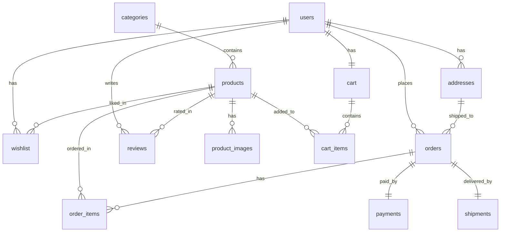

# FrameWala E-Commerce Website

Welcome to **FrameWala**, a beginner-friendly full-stack e-commerce website designed to sell customized products such as:
- **Photo Frames**
- **Printed Mugs**
- **Printed T-Shirts**
- **Customized Gifts**

---

## 📂 Project Structure

This project uses a clean, non-enterprise folder structure ideal for learning and deployment:

```text
FrameWala/
│
├── frontend/                     # React + Vite + Tailwind CSS Frontend
│   └── package.json              # Frontend dependencies and build configurations
│
├── backend/                      # Node.js + Express.js API Backend
│   ├── package.json              # Backend dependencies
│   ├── server.js                 # API server entrypoint (Express setup)
│   └── .env.example              # Template for environment configuration
│
├── database/                     # MySQL Relational Database Scripts
│   ├── 01_create_database.sql   # Creates database and switches context
│   ├── 02_users.sql             # Users table schema
│   ├── 03_categories.sql        # Product Categories table schema
│   ├── 04_products.sql          # Products table schema
│   ├── 05_product_images.sql    # Product multi-images schema
│   ├── 06_addresses.sql         # Addresses table schema
│   ├── 07_cart.sql              # Active shopping carts schema
│   ├── 08_cart_items.sql        # Items within shopping carts schema
│   ├── 09_wishlist.sql          # Wishlist/Favorites schema
│   ├── 10_orders.sql            # Core checkout orders schema
│   ├── 11_order_items.sql       # Purchase transaction item logs schema
│   ├── 12_payments.sql          # Razorpay/Payment transactions schema
│   ├── 13_shipments.sql         # Shipment tracking logs schema
│   ├── 14_reviews.sql           # Ratings and customer reviews schema
│   └── 15_sample_data.sql       # Seeding file containing test data
│
└── README.md                     # Project blueprint and database documentation (This file)
```

---

## 📊 Database Design (ER Diagram)

Below is the Entity-Relationship (ER) diagram representing how the tables in the `framewala_db` database relate to one another:



---

## 🔑 Database Key Features

To maintain reliability, integrity, and simplicity:
- **`AUTO_INCREMENT`**: Used on all integer primary keys to automatically generate unique records.
- **`NOT NULL`**: Applied to mandatory attributes (e.g., product pricing, emails, passwords) to avoid corrupted states.
- **`UNIQUE` Constraints**: Applied to prevent duplicate emails (`users.email`), duplicate cart entries (`cart_items.cart_id + product_id`), duplicate reviews (`reviews.user_id + product_id`), and identical payment tracker IDs (`payments.razorpay_payment_id`).
- **`created_at` & `updated_at`**: Auditing timestamps to log when records are introduced or updated.

---

## 📝 Table-by-Table Explanation

Here is a simple explanation of each table's role in the FrameWala store:

### 1. `users`
- **Purpose**: Stores all accounts registered with FrameWala.
- **Roles**: Distinct permissions managed using a `role` flag, supporting `'customer'` and `'admin'`.
- **Columns**: `user_id` (PK), `first_name`, `last_name`, `email` (Unique login key), `phone`, `password` (hashed for security), `role`, `is_active`, `created_at`, `updated_at`.

### 2. `categories`
- **Purpose**: Grouping mechanism for products (e.g., Photo Frames, Mugs, etc.).
- **Columns**: `category_id` (PK), `category_name` (Unique, e.g., 'Printed Mugs'), `description`, `created_at`.

### 3. `products`
- **Purpose**: Master inventory of all products.
- **Customizability**: Uses `is_customizable` (Boolean) to flag if a customer can upload custom photos or specify engravings for this item during checkout.
- **Columns**: `product_id` (PK), `category_id` (FK to categories), `product_name`, `description`, `price`, `stock_quantity`, `is_customizable`, `created_at`, `updated_at`.

### 4. `product_images`
- **Purpose**: Stores all product images, supporting multiple images (e.g., front, back, lifestyle views) per product.
- **Normalized Design Benefits**:
  - **No Columns Bloat**: Prevents adding multiple static columns (e.g., `image1`, `image2`) to the `products` table or storing comma-separated lists (which violate first normal form).
  - **Order Control**: Supports dynamic rendering sequences via the `display_order` field.
  - **Primary Views**: Easily query the main thumbnail image using the `is_primary` flag (`WHERE is_primary = TRUE`) to load index pages quickly without fetching secondary gallery images.
- **Columns**: `image_id` (PK), `product_id` (FK to products), `image_url`, `display_order`, `is_primary` (Boolean), `created_at`.

### 5. `addresses`
- **Purpose**: Houses shipping and billing addresses. A single user can have multiple saved addresses (e.g., "Home", "Office").
- **Columns**: `address_id` (PK), `user_id` (FK to users), `full_name`, `phone`, `address_line`, `city`, `state`, `pincode`.

### 6. `cart`
- **Purpose**: Holds the customer's active shopping cart session. Each user gets exactly *one* cart (`user_id` is UNIQUE).
- **Columns**: `cart_id` (PK), `user_id` (FK to users), `created_at`.

### 7. `cart_items`
- **Purpose**: Intermediary table mapping items placed inside a cart, along with the requested quantities.
- **Columns**: `cart_item_id` (PK), `cart_id` (FK to cart), `product_id` (FK to products), `quantity`.

### 8. `wishlist`
- **Purpose**: Stores products favorited by a user so they can buy or view them later.
- **Columns**: `wishlist_id` (PK), `user_id` (FK to users), `product_id` (FK to products).

### 9. `orders`
- **Purpose**: Logs placed orders. This represents a snapshot of the transaction total, payment status, and dispatch status.
- **Columns**: `order_id` (PK), `user_id` (FK to users), `address_id` (FK to addresses), `total_amount`, `order_status` (pending/processing/shipped/delivered/cancelled), `payment_status` (pending/paid/failed/refunded), `created_at`.

### 10. `order_items`
- **Purpose**: Line items detailing exactly what products were purchased in an order, capturing the historical unit price (in case the shop changes the product's price in the future).
- **Columns**: `order_item_id` (PK), `order_id` (FK to orders), `product_id` (FK to products), `quantity`, `price` (historical unit price).

### 11. `payments`
- **Purpose**: Records financial transaction logs, ready to hook up with Razorpay APIs.
- **Columns**: `payment_id` (PK), `order_id` (FK to orders), `payment_method`, `razorpay_payment_id`, `payment_status` (pending/completed/failed/refunded), `payment_date`.

### 12. `shipments`
- **Purpose**: Logistics tracker for orders dispatched to users, containing courier details and expected delivery windows.
- **Columns**: `shipment_id` (PK), `order_id` (FK to orders), `courier_name`, `tracking_number`, `shipment_status`, `expected_delivery`.

### 13. `reviews`
- **Purpose**: Stores product reviews and star ratings. Users can review a specific product at most once.
- **Columns**: `review_id` (PK), `product_id` (FK to products), `user_id` (FK to users), `rating` (Integer 1-5), `review` (text), `created_at`.

---

## 🔗 Relationships & Foreign Keys (FK)

Foreign key constraints are crucial for maintaining logical links between tables:

1. **`categories ──> products`**
   - *Relation*: `products.category_id` references `categories.category_id`.
   - *Behavior*: `ON DELETE SET NULL`. If a category is deleted, products in that category remain but their category is marked as NULL.
2. **`products ──> product_images / cart_items / wishlist / reviews`**
   - *Relation*: Foreign keys in these dependent tables reference `products.product_id`.
   - *Behavior*: `ON DELETE CASCADE`. If a product is permanently removed, its images, cart listings, wishlist links, and reviews vanish automatically.
3. **`users ──> addresses / cart / wishlist / reviews`**
   - *Relation*: Foreign keys reference `users.user_id`.
   - *Behavior*: `ON DELETE CASCADE`. Deleting a user profile removes their personal data automatically.
4. **`users ──> orders` & `addresses ──> orders`**
   - *Relation*: `orders.user_id` references `users.user_id`, and `orders.address_id` references `addresses.address_id`.
   - *Behavior*: `ON DELETE RESTRICT`. You **cannot** delete a user or address if they have historical orders. This prevents orphaned records in accounting logs.
5. **`orders ──> order_items / payments / shipments`**
   - *Relation*: Foreign keys reference `orders.order_id`.
   - *Behavior*: `ON DELETE CASCADE`. If an order is deleted, all related line items, payment logs, and shipment details are deleted.
6. **`products ──> order_items`**
   - *Relation*: `order_items.product_id` references `products.product_id`.
   - *Behavior*: `ON DELETE RESTRICT`. A product cannot be deleted if it was ordered in the past.

---

## ⚡ Suggested Database Indexes

Indexes speed up query execution. In addition to primary and unique keys (which MySQL indexes automatically), these are highly recommended for the FrameWala database:

1. **`users(email)`**
   - *Reason*: Login operations will run queries like `SELECT * FROM users WHERE email = ?`. (MySQL UNIQUE key indexes this automatically).
2. **`products(category_id)`**
   - *Reason*: Loading products page filters items: `SELECT * FROM products WHERE category_id = ?`. (MySQL creates this automatically for foreign keys).
3. **`products(price)`**
   - *Reason*: Filtering and sorting by price: `SELECT * FROM products ORDER BY price ASC`.
4. **`orders(user_id)`**
   - *Reason*: Fetching order history for user dashboards: `SELECT * FROM orders WHERE user_id = ?`.
5. **`reviews(product_id)`**
   - *Reason*: Fetching reviews on the product details page: `SELECT * FROM reviews WHERE product_id = ?`.
6. **`product_images(product_id, is_primary)`**
   - *Reason*: Fetching the primary thumbnail image for product catalog listings: `SELECT * FROM product_images WHERE product_id = ? AND is_primary = TRUE`.

---

## 🚀 Setup & Execution Guide (Local MySQL)

To set up the MySQL database on your local machine:

1. Open your terminal or MySQL command line client.
2. Login to your MySQL server:
   ```bash
   mysql -u root -p
   ```
3. Source the files in sequence to build the database, compile the schemas, and import sample test data:
   ```sql
   SOURCE database/01_create_database.sql;
   SOURCE database/02_users.sql;
   SOURCE database/03_categories.sql;
   SOURCE database/04_products.sql;
   SOURCE database/05_product_images.sql;
   SOURCE database/06_addresses.sql;
   SOURCE database/07_cart.sql;
   SOURCE database/08_cart_items.sql;
   SOURCE database/09_wishlist.sql;
   SOURCE database/10_orders.sql;
   SOURCE database/11_order_items.sql;
   SOURCE database/12_payments.sql;
   SOURCE database/13_shipments.sql;
   SOURCE database/14_reviews.sql;
   SOURCE database/15_sample_data.sql;
   ```
4. Confirm successful loading by running a simple query:
   ```sql
   USE framewala_db;
   SELECT * FROM products;
   ```
# FrameWala.online

# FrameWala.online

